# Mangrobe

Time-series Table Protocol - like Iceberg, but built for time-series, streaming, and multi-tenancy.

# Features

* **Fast file registration**. Adding new files won't conflict.
* **Easy operation**. No Hadoop or ZooKeeper required.
* **Easy integration**. No complicated implementation needed — just gRPC.
* **Multi-tenancy**. No conflicts across tenants.

# Examples

You can see examples in [examples](./mangrobe-lab/examples) directory

# Overview

# Mangrobe Protocol

Refer to [api.proto](./spec/proto/api.proto) for details.

## Add Files
Use `AddFiles` to register new files.

## Compact Files
Use `CompactFiles` to compact existing files after acquiring the lock.

```mermaid
sequenceDiagram
    Writer->>API Server: gRPC(AcquireFileLock)
    API Server-->>Writer: 🔒 File Locked
    Writer->>API Server: gRPC(CompactFiles)
    API Server-->>Writer: Done
```

## Multi-stream
Locks are per file, so other streams and files outside the lock can still be updated.

