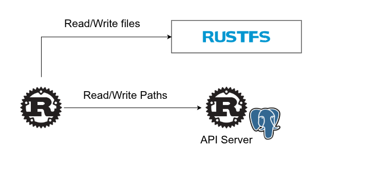
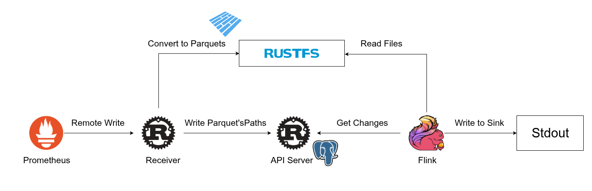

# Mangrobe Examples

This directory provides Mangrobe examples.

1. [api-demo](api-demo): Run the gRPC API directly.  
    
2. [datafusion-reader](datafusion-reader): Execute SQL with DataFusion.  
   
3. [prometheus-flink](prometheus-flink): Receive Prometheus metrics and consume them with Flink.  
   
