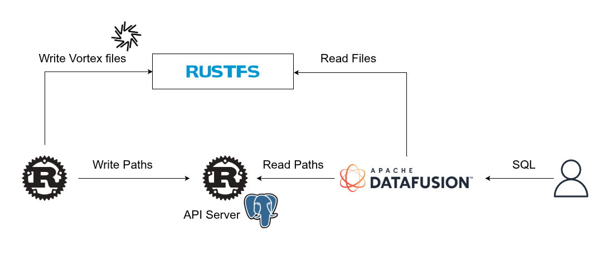

# DataFusion Reader

Execute SQL with DataFusion.  



# How to run

1. Run Docker Compose for api-server
    ```shell
    cd mangrobe-api-server
    docker compose up
    ```
2. Run api server
    ```shell
    cd mangrobe-api-server
    make migrate/fresh
    cargo run
    ```
3. Run Object Storage(RustFS)
    ```shell
    cd mangrobe-lab
    docker compose up
    ```
4. Run datafusion-reader to QUERY
    ```shell
    cd mangrobe-lab
    cargo run --example datafusion-reader
    ```

Then, you will see the result of SQL. like:
```
Running datafusion-reader...
Running: SELECT * FROM custom_vortex_table order by id limit 3
+----+------+-----------------+
| id | code | name            |
+----+------+-----------------+
| 1  | -1   | hello 1 world 1 |
| 2  | -2   | hello 2 world 2 |
| 3  | -3   | hello 3 world 3 |
+----+------+-----------------+
Running: SELECT * FROM custom_vortex_table order by id desc limit 3
+-------+--------+-------------------------+
| id    | code   | name                    |
+-------+--------+-------------------------+
| 23099 | -23099 | hello 23099 world 23099 |
| 23098 | -23098 | hello 23098 world 23098 |
| 23097 | -23097 | hello 23097 world 23097 |
+-------+--------+-------------------------+
...
```
